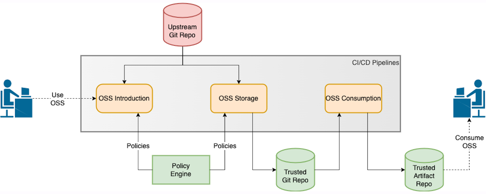

# CDF Software Supply Chain Proof of Concept

# Quick links

* [Introduction](#Introduction)
* [Objectives](#Objectives)
* [Scope](#Scope)
    * [Activities](#Activities)
    * [Technologies](#Technologies)
    * [Environments](#Environments)
* [Resource Requirements](#Resource-Requirements)
* [PoC Team](#PoC-Team)
* [References](#References)

# Introduction

[CDF Special Interest Group (SIG) Software Supply Chain](https://github.com/cdfoundation/sig-software-supply-chain) aims to contribute overall efforts to improve the state of software supply chain from CI/CD perspective. The way the SIG aims to achieve this is to brainstorm around the software supply chain topics that are relevant to CI/CD space and take a practical and experimental approach to identify process and technology aspects that are beneficial for organizations.

This document aims to start discussion around the practical and experimental approach within the SIG and heavily (re)uses information from CDF and sister communities that are referenced at the end of the document. Reusing outcome of the other initiatives is important in order to make sure we don't reinvent the wheel and instead look for opportunities to collaborate with and contribute to those efforts.

Another important aspect to highlight is non-Cloud Native projects and products (e.g., mobile, embedded) and the CI/CD pipelines for those. It is important to include this as part of the work.

# Objectives

The objectives of this PoC are

* Identify CI/CD activities, stages, and steps that are critical for software supply chain
* Demonstrate key software supply chain activities, stages, and steps both from product perspective as well as from CI/CD technology and pipelines perspectives
* Use different CI/CD tools and technologies while establishing CI/CD pipelines to demonstrate capabilities provided by them
* Demonstrate the differences across the pipelines running on on-premises vs cloud based environments

# Scope

Based on the objectives of the PoC, the three areas to include in the scope are

* Activities
* Technologies
* Environments

Due to the size and complexity of these areas, it may be necessary to split the PoC to multiple phases. However, if the community desires to look into multiple areas in conjunction with each other, it is possible to do that as well, assuming CDF could provide compute resources.

## Activities

One of the initial steps to take is to identify the activities and corresponding pipelines to be demonstrated by the PoC. Some activities are documented here in order to get the conversation started.

Activities referred here are the activities that are deemed critical for security, compliance, and authenticity of the software produced by the organizations as well as third party code (e.g., open source software). The focus of this part of the PoC is on Open Source Software (OSS) due to practical reasons however most of the activities listed in this section should be applicable also to software produced by the organization.

Some example activities are listed below in order to start the conversation around what activities the PoC should demonstrate. Please note that these activities documented here require to be synched with and contributed to ongoing work under other groups such as SIG Interoperability stage and step work, SIG Best Practices, and so on.

### Development

#### OSS Introduction

This activity deals with introduction and vetting of the OSS that is about to be used by the organization for development purposes.

Inputs to this activity are

* Public/upstream URL to source code repository of the primary OSS
* Version of the primary OSS
* Policies

The tasks that could be performed under this activity/by corresponding pipeline(s) are

* Community Assessment (e.g., no of contributors)
* Metadata gathering (e.g., version, date)
* Fetching community generated SBOM
* License/copyright identification
* Vulnerability analysis
* Malware scanning
* Quality checks (e.g., static analysis)
* Policy enforcement/compliance (e.g., provenance, license, vulnerability)

Outputs of this activity are

* Metadata, records, logs, SBOM
* Evaluation result/score based on policies

Please note that the analysis/scanning tasks listed in this activity capture the state of the OSS component in that point of time when the tasks are run. However, it is possible that new issues and vulnerabilities may be disclosed over time, making the outcome of evaluation for already introduced (versions of) components outdated so it is important to run such tasks in a continuous manner to reevaluate components and address issues by updating their versions of replacing them with other components.

#### OSS Storage

The purpose of this activity is to store the primary OSS and its dependencies from its origin on internal/secure/trusted repositories for further activities as well as for making it available for consumption by the rest of the development organization.

Inputs to this activity are

* Public/upstream URL to source code repository of the primary OSS
* Version of the primary OSS
* Policies

The tasks that could be performed under this activity/by corresponding pipeline(s) are

* Download and storage of primary OSS source code
* Source code based SBOM generation and analysis
* Dependency analysis
* Download and storage of dependencies
* Delta report generation
* Policy enforcement/compliance

Outputs of this activity are

* Metadata, records, reports, logs, delta report, SBOM
* Evaluation result/score based on policies
* Source code of the primary OSS on internal/secure/trusted repository
* Source code of the dependencies on internal/secure/trusted repository

#### OSS Consumption

In most cases, organizations download and use (pre-built) artifacts/binaries of the primary OSS and its dependencies from the internet. However, this is not considered secure so building artifacts in a secure environment by using the source code stored on internal/secure/trusted repositories is a critical capability to demonstrate.

Inputs to this activity are

* Internal URL to source code repository of the primary OSS
* Version of the primary OSS
* Internal URL to source code repository of the dependencies
* Policies

The tasks that could be performed under this activity/by corresponding pipeline(s) are

* Build
* Build SBOM generation and analysis
* Delta report generation
* Artifact signing
* Storage of binaries
* Policy enforcement/compliance

Outputs of this activity are

* Metadata, records, reports, logs, delta report, build SBOM
* Evaluation result/score based on policies
* Signed artifacts/binaries of the primary OSS

### Production

TBD

## Technologies

The proposed PoC requires technology selections to be made in order to create the CI/CD pipelines for the activities documented in the previous chapter.

### Technology Selections

\<add diagram\>

Various communities such as CNCF and OpenSSF are actively working on reference architecture and reference implementation so the PoC is proposed to use one of them as a base. The initiatives that are proposed to be used as part of the PoC are

* CNCF TAG Security Secure Software Factory Reference Architecture
* OpenSSF SSF Reference Implementation (still pending to be accepted to OpenSSF)

The SSF uses certain tools and technologies (e.g., Tekton Pipelines, Kyverno). However, the PoC can evolve the SSF further by introducing new technologies such as Open Policy Agent (OPA) or replacing the used technologies with others such as Jenkins X to demonstrate how one can use different technologies to have different capabilities.

### Security and Compliance of Technologies and Pipelines

Another critical aspect to take into consideration is the security and compliance of the technologies and pipelines themselves so they cannot be abused by actors with malicious intentions. The activities that can be demonstrated to ensure the technologies used while establishing CI/CD systems and pipelines are similar to those used for the primary OSS however there are additional concerns to think about from pipelines perspective such as

* Is the pipeline supposed to do what it is doing
* Are the credentials secured
* Privilege levels
* Observability of pipelines

## Environments

The environments used by the organizations while establishing their CI/CD pipelines differ due to various reasons and the potential risks and challenges need to be identified and demonstrated.

### On Premise

Organizations that establish and run CI/CD pipelines on on-premise environments must take necessary steps to make sure their pipelines are secure and compliant.

### Cloud

CI/CD services established by public cloud providers require additional aspects to be taken into consideration since the users may not have same control over the environments, technologies, and pipelines.

# Resource Requirements

TBD

# PoC Team

TBD

# References

* [CDF SIG Software Supply Chain Charter](https://github.com/cdfoundation/sig-software-supply-chain/blob/main/README.md)
* [CDF SIG Software Supply Chain Kick Off Meeting Presentation](https://docs.google.com/presentation/d/1-nt-1Pe4WwiKoDT-ooWAxKPDunSoqeES9Qb3WTEkE9M/edit#slide=id.g1195d02e4a0_2_57)
* [CDF SIG Interoperability Pipeline Stage Terminology PR](https://github.com/cdfoundation/sig-interoperability/pull/76)
* [CDF SIG Interoperability Pipeline Steps PR](https://github.com/cdfoundation/sig-interoperability/pull/81)
* [CDF SIG Interoperability Quality Gates Discussion](https://github.com/cdfoundation/sig-interoperability/discussions/83)
* [CNCF Secure Software Factory Reference Architecture RFC](https://docs.google.com/document/d/15M_Mzfqy634E_sqoslmOXsZJl4TedpbXpBjOfz-hnXk/edit)
* [CNCF TAG Security Cloud Native Security Whitepaper](https://github.com/cncf/tag-security/blob/main/security-whitepaper/CNCF_cloud-native-security-whitepaper-Nov2020.pdf)
* [CNCF TAG Security Supply Chain Best Practices](https://github.com/cncf/tag-security/blob/main/supply-chain-security/supply-chain-security-paper/CNCF_SSCP_v1.pdf)
* [OpenSSF SSF Reference Implementation](https://github.com/buildsec/ssf) (*proposed as a project*)
* [CNCF Podtato Head](https://github.com/podtato-head/podtato-head)
* [Cider Security Top 10 CI/CD Security Risks](https://www.cidersecurity.io/wp-content/uploads/2022/03/Top-10-CICD-Security-Risks-.pdf)
* [CI/CD Goat](https://github.com/cider-security-research/cicd-goat)
